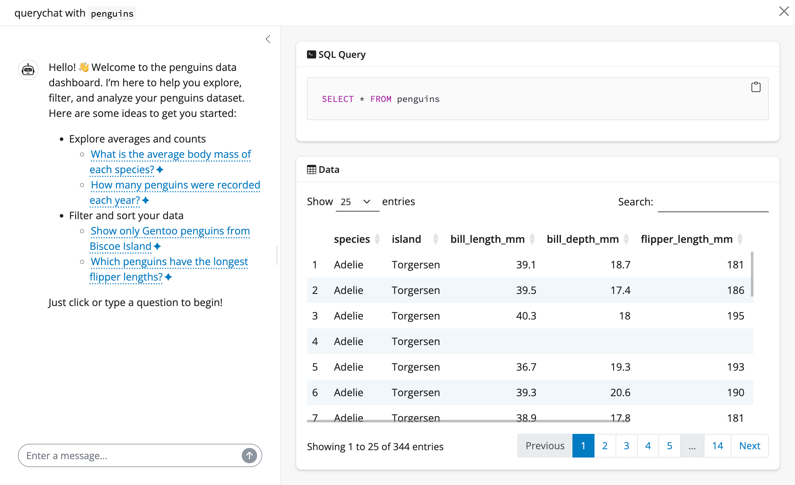
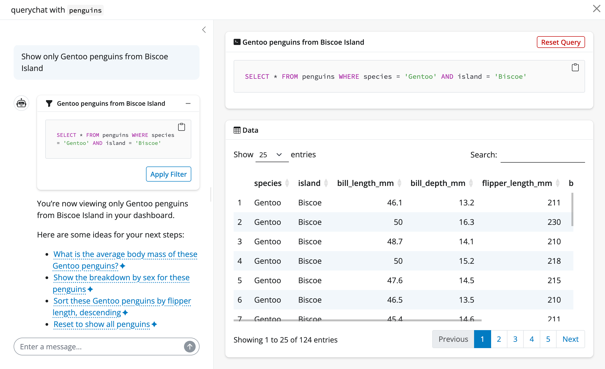
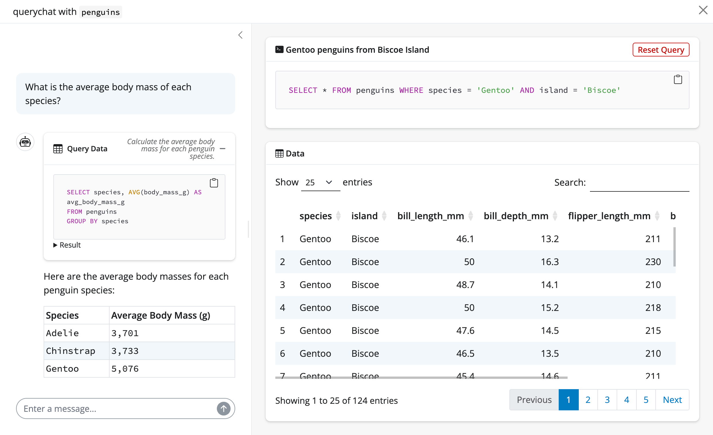
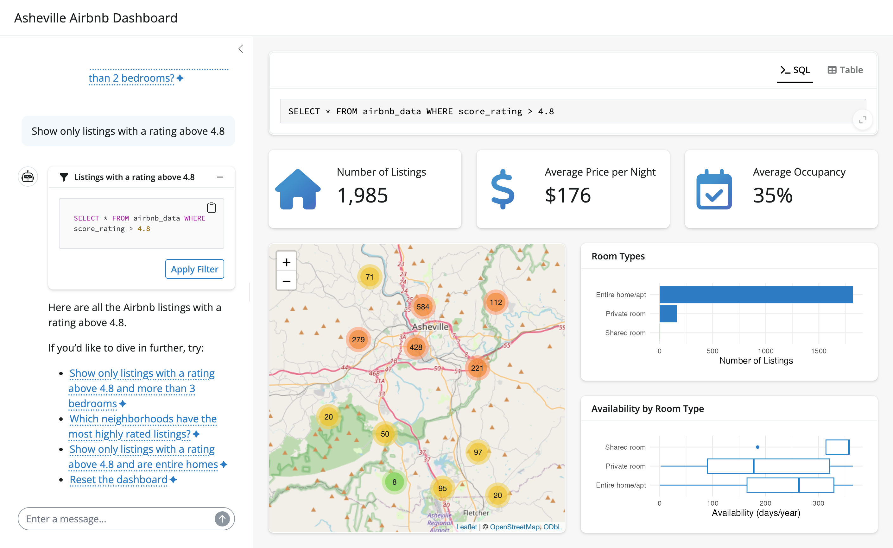

# querychat <a href="https://posit-dev.github.io/querychat/r/"></a>

<!-- badges: start -->
[](https://github.com/posit-dev/querychat/actions/workflows/R-CMD-check.yaml)
[](https://CRAN.R-project.org/package=querychat)
<!-- badges: end -->

QueryChat facilitates safe and reliable natural language exploration of tabular data, powered by SQL and large language models (LLMs). For analysts, it offers an intuitive web application where they can quickly ask questions of their data and receive verifiable data-driven answers. For software developers, QueryChat provides a comprehensive R interface to access core functionality -- including the chat UI, generated SQL statements, resulting data, and. This capability enables the seamless integration of natural language querying into bespoke data applications.

## Installation

Install the stable release from CRAN:

```r
install.packages("querychat")
```

Or the development version from GitHub:

```r
# install.packages("pak")
pak::pak("posit-dev/querychat/pkg-r")
```

## Quick start

The quickest way to start chatting with your data is via `querychat_app()`, which provides a fully polished Shiny app. It requires a [data source](articles/data-sources.html) (e.g., data.frame, database connection, etc.) and optionally other parameters (e.g. the LLM `client` [model](articles/models.html)).

```r
library(querychat)
library(palmerpenguins)

querychat_app(penguins, client = "openai/gpt-4.1")
```

Once running (which requires an API key[^api-key]), you'll notice 3 main views:

[^api-key]: By default, querychat uses OpenAI to power the chat experience. So, for this example to work, you'll need [an OpenAI API key](https://platform.openai.com/). See the [Models](articles/models.html) article for details on how to set up credentials for other model providers.

1. A sidebar chat with suggestions on where to start exploring.
2. A data table that updates to reflect filtering and sorting queries.
3. The SQL query behind the data table, for transparency and reproducibility.

{alt="Screenshot of querychat's app with the penguins dataset." class="rounded shadow"}

Suppose we pick a suggestion like "Show me Adelie penguins". Since this is a filtering operation, both the data table and SQL query update accordingly.

{alt="Screenshot of the querychat's app with the penguins dataset filtered." class="rounded shadow"}

QueryChat can also handle more general questions about the data that require calculations and aggregations. For example, we can ask "What is the average bill length by species?". In this case, QueryChat will generate/execute the SQL query to perform the relevant calculation, and return the result in the chat:

{alt="Screenshot of the querychat's app with a summary statistic inlined in the chat." class="rounded shadow"}

## Custom apps

QueryChat is designed to be highly extensible -- it provides programmatic access to the chat interface, the filtered/sorted data frame, SQL queries, and more.
This makes it easy to build custom web apps that (safely) leverage natural language interaction with your data.
For example, [here](https://github.com/posit-conf-2025/llm/blob/main/_solutions/25_querychat/25_querychat_02-end-app.R)'s a bespoke app for exploring Airbnb listings in Ashville, NC:

{alt="A custom app for exploring Airbnb listings, powered by QueryChat." class="shadow rounded mb-3"}

To learn more, see [Build an app](articles/build.html) for a step-by-step guide.

## How it works

QueryChat leverages LLMs' incredible capability to translate natural language into SQL queries. Frontier models are shockingly good at this task, but even the best models still need to know the overall data structure to perform well. For this reason, QueryChat supplies a [system prompt](articles/context.html) with the schema of the data (i.e., column names, types, ranges, etc), but never the raw data itself.

When the LLM generates a SQL query, QueryChat executes it against a SQL database (DuckDB[^duckdb] by default) to get results in a **safe**, **reliable**, and **verifiable** manner. In short, this execution is **safe** since only `SELECT` statements are allowed, **reliable** since the database engine handles all calculations, and **verifiable** since the user can always see the SQL query that was run. This makes QueryChat a trustworthy tool for data exploration, as every action taken by the LLM is transparent and independently reproducible.

::: {.alert .alert-warning}
**Data privacy**

See the [Provide context](articles/context.html) and [Tools](articles/tools.html) articles to learn more about what information is provided to the LLM and what it's capable of doing with code execution.
:::

[^duckdb]: DuckDB is extremely fast and has a surprising number of [statistical functions](https://duckdb.org/docs/stable/sql/functions/aggregates.html#statistical-aggregates).


## Next steps

From here, you might want to learn more about:

- [Models](articles/models.html): customize the LLM behind querychat.
- [Data sources](articles/data-sources.html): different data sources you can use with querychat.
- [Provide context](articles/context.html): provide the LLM with the context it needs to work well.
- [Build an app](articles/build.html): design a custom Shiny app around querychat.
- [Greet users](articles/greet.html): create welcoming onboarding experiences.
- [Tools](articles/tools.html): understand what querychat can do under the hood.
