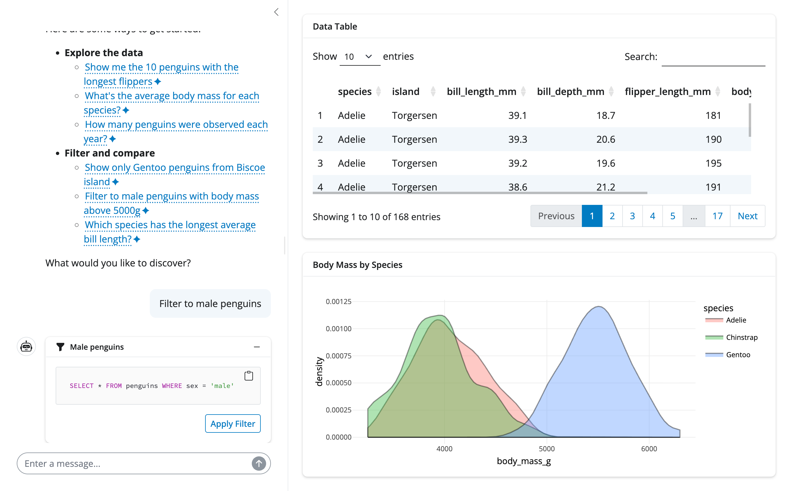

```{r, include = FALSE}
knitr::opts_chunk$set(
  collapse = TRUE,
  comment = "#>",
  eval = FALSE
)
```

While `querychat_app()` provides a quick way to start exploring data, building bespoke Shiny apps with querychat unlocks the full power of integrating natural language data exploration with custom visualizations, layouts, and interactivity. This guide shows you how to integrate querychat into your own Shiny applications and leverage its reactive data outputs to create rich, interactive experiences.

querychat lets users ask questions of their data in plain language — filtering, sorting, summarizing, joining across tables, and creating visualizations — all without needing to write SQL or navigate complex filter UIs. You can use it as the primary exploration interface in a standalone app, or embed it alongside curated views in an existing dashboard to let users go deeper than the views you designed.

This is especially valuable when:

- Your data has many columns and building a UI for all possible filters would be overwhelming
- Users want to explore ad-hoc combinations of filters that you didn't anticipate
- You have multiple related tables that users may want to query and join
- You want to make data exploration more accessible to non-technical users


## Starter template

Integrating querychat into a Shiny app requires just three steps:

1. Initialize a `QueryChat` instance with your data
2. Add the UI component (either `$sidebar()` or `$ui()`)
3. Use reactive values like `$df()`, `$sql()`, and `$title()` to build outputs that respond to user queries

Here's a starter template demonstrating these steps:

```{r}
library(shiny)
library(bslib)
library(querychat)
library(DT)
library(palmerpenguins)

# Step 1: Initialize QueryChat
qc <- QueryChat$new(penguins)

# Step 2: Add UI component
ui <- page_sidebar(
  sidebar = qc$sidebar(),
  card(
    card_header("Data Table"),
    dataTableOutput("table")
  ),
  card(
    fill = FALSE,
    card_header("SQL Query"),
    verbatimTextOutput("sql")
  )
)

# Step 3: Use reactive values in server
server <- function(input, output, session) {
  qc_vals <- qc$server()
  
  output$table <- renderDataTable({
    datatable(qc_vals$df(), fillContainer = TRUE)
  })

  output$sql <- renderText({
    qc_vals$sql() %||% "SELECT * FROM penguins"
  })
}

shinyApp(ui, server)
```

::: {.alert .alert-info}
You'll need to call the `qc$server()` method within your server function to set up querychat's reactive behavior, and capture its return value to access reactive data.
:::

## Deferred data sources {#deferred-data-sources}

Some data sources, like database connections or reactive calculations, may need to be created within an active Shiny session. To help support this, `QueryChat` allows you to initialize without a data source and provide it later, like this:

```{r}
library(shiny)
library(bslib)
library(querychat)

# Global scope - create QueryChat without data source
qc <- QueryChat$new(NULL, "users")

ui <- page_sidebar(
  sidebar = qc$sidebar(),
  card(dataTableOutput("table"))
)

server <- function(input, output, session) {
  # Server scope - create connection with session credentials
  conn <- get_user_connection(session)
  qc_vals <- qc$server(data_source = conn)

  output$table <- renderDataTable({
    qc_vals$df()
  })
}

shinyApp(ui, server)
```

If your chat client also depends on session-scoped credentials, you can defer that too by passing it to `qc$server(client = ...)` alongside the `data_source`.

This is also a useful pattern when using something like [`{pool}`](https://github.com/rstudio/pool) to efficiently manage a pool of database connections (which we strongly recommend for production apps).

## Reactives

There are three main reactive values provided by querychat for use in your app:

### Filtered data {#filtered-data}

The `$df()` method returns the current filtered and/or sorted data frame. This updates whenever the user prompts a filtering or sorting operation through the chat interface (see [Data updating](tools.html#data-updating) for details).

```{r}
qc_vals <- qc$server()

output$table <- renderDataTable({
  qc_vals$df()  # Returns filtered/sorted data
})
```

You can use `$df()` to power any output in your app - visualizations, summary statistics, data tables, and more. When a user asks to "show only Adelie penguins" or "sort by body mass", `$df()` automatically updates, and any outputs that depend on it will re-render.

### SQL query {#sql-query}

The `$sql()` method returns the current SQL query as a string. This is useful for displaying the query to users for transparency and reproducibility:

```{r}
qc_vals <- qc$server()

output$current_query <- renderText({
  qc_vals$sql() %||% "SELECT * FROM penguins"
})
```

You can also use `$sql()` as a setter to programmatically update the query (see [Programmatic filtering](#programmatic-filtering) below).

### Title {#title}

The `$title()` method returns a short description of the current filter, provided by the LLM when it generates a query. For example, if a user asks to "show Adelie penguins", the title might be "Adelie penguins".

```{r}
qc_vals <- qc$server()

output$card_title <- renderText({
  qc_vals$title() %||% "All Data"
})
```

Returns `NULL` when no filter is active. You can also use `$title()` as a setter to update the title programmatically.

## Custom UI

In the starter template above, we used the `$sidebar()` method for a simple sidebar layout. In some cases, you might want to place the chat UI somewhere else in your app layout, or just more fully customize what goes in the sidebar. The `$ui()` method is designed for this -- it returns the chat component without additional layout wrappers.

For example, you might want to create some additional controls to [reset filters](#programmatic-filtering) alongside the chat UI:

```{r}
library(querychat)
library(palmerpenguins)

qc <- QueryChat$new(penguins)

ui <- page_sidebar(
  sidebar = sidebar(
    qc$ui(),  # Chat component
    actionButton("reset", "Reset Filters", class = "w-100"),
    fillable = TRUE,
    width = 300
  ),
  # Main content here
)
```

::: {.alert .alert-info}
**Customizing chat UIs**

See `{shinychat}`'s [docs](https://posit-dev.github.io/shinychat/r/index.html) to learn more about customizing the chat UI component returned by `qc$ui()`.
:::

## Data views

Thanks to Shiny's support for interactive visualizations with packages like [plotly](https://plotly.com/r/), it's straightforward to create rich data views that depend on QueryChat data. Here's an example of an app showing both the filtered data and a bar chart depending on that same data:

<details>
<summary> <code>app.R </code> </summary>

```{r}
library(shiny)
library(bslib)
library(querychat)
library(DT)
library(plotly)
library(palmerpenguins)

qc <- QueryChat$new(penguins, client = "claude/claude-sonnet-4-5")

ui <- page_sidebar(
  sidebar = qc$sidebar(),
  card(
    card_header("Data Table"),
    dataTableOutput("table")
  ),
  card(
    card_header("Body Mass by Species"),
    plotlyOutput("mass_plot")
  )
)

server <- function(input, output, session) {
  qc_vals <- qc$server()

  output$table <- renderDataTable({
    datatable(qc_vals$df(), fillContainer = TRUE)
  })

  output$mass_plot <- renderPlotly({
    ggplot(qc_vals$df(), aes(x = body_mass_g, fill = species)) +
      geom_density(alpha = 0.4) +
      theme_minimal()
  })
}

shinyApp(ui, server)
```

</details>

{alt="Screenshot of a querychat app showing both a data table and a density plot of body mass by species" class="shadow rounded mb-3"}

A more useful, but slightly more involved example like the one below might incorporate other Shiny components like value boxes to summarize key statistics about the filtered data.

<details>
<summary> <code>app.R </code> </summary>

```{r}
library(shiny)
library(bslib)
library(DT)
library(plotly)
library(palmerpenguins)
library(dplyr)
library(bsicons)
library(querychat)


qc <- QueryChat$new(penguins)

ui <- page_sidebar(
  title = "Palmer Penguins Analysis",
  class = "bslib-page-dashboard",
  sidebar = qc$sidebar(),
  layout_column_wrap(
    width = 1 / 3,
    fill = FALSE,
    value_box(
      title = "Total Penguins",
      value = textOutput("count"),
      showcase = bs_icon("piggy-bank"),
      theme = "primary"
    ),
    value_box(
      title = "Species Count",
      value = textOutput("species_count"),
      showcase = bs_icon("bookmark-star"),
      theme = "success"
    ),
    value_box(
      title = "Avg Body Mass",
      value = textOutput("avg_mass"),
      showcase = bs_icon("speedometer"),
      theme = "info"
    )
  ),
  layout_columns(
    card(
      card_header(textOutput("table_title")),
      DT::dataTableOutput("data_table")
    ),
    card(
      card_header("Species Distribution"),
      plotlyOutput("species_plot")
    )
  ),
  layout_columns(
    card(
      card_header("Bill Length Distribution"),
      plotlyOutput("bill_length_dist")
    ),
    card(
      card_header("Body Mass by Species"),
      plotlyOutput("mass_by_species")
    )
  )
)

server <- function(input, output, session) {
  qc_vals <- qc$server()

  output$count <- renderText({
    nrow(qc_vals$df())
  })

  output$species_count <- renderText({
    length(unique(qc_vals$df()$species))
  })

  output$avg_mass <- renderText({
    avg <- mean(qc_vals$df()$body_mass_g, na.rm = TRUE)
    paste0(round(avg, 0), "g")
  })

  output$table_title <- renderText({
    qc_vals$title() %||% "All Penguins"
  })

  output$data_table <- DT::renderDataTable({
    DT::datatable(
      qc_vals$df(),
      fillContainer = TRUE,
      options = list(
        scrollX = TRUE,
        pageLength = 10,
        dom = "ti"
      )
    )
  })

  output$species_plot <- renderPlotly({
    plot_ly(
      count(qc_vals$df(), species),
      x = ~species,
      y = ~n,
      type = "bar",
      marker = list(color = c("#1f77b4", "#ff7f0e", "#2ca02c"))
    )
  })

  output$bill_length_dist <- renderPlotly({
    plot_ly(
      qc_vals$df(),
      x = ~bill_length_mm,
      type = "histogram",
      nbinsx = 30,
      marker = list(color = "#1f77b4", opacity = 0.7)
    )
  })

  output$mass_by_species <- renderPlotly({
    plot_ly(
      qc_vals$df(),
      x = ~species,
      y = ~body_mass_g,
      color = ~sex,
      type = "box",
      colors = c("#1f77b4", "#ff7f0e")
    )
  })
}

shinyApp(ui = ui, server = server)
```

</details>


## Programmatic updates {#programmatic-filtering}

querychat's reactive state can be updated programmatically. For example, you might want to add a "Reset Filters" button that clears any active filters and returns the data table to its original state. You can do this by setting both the SQL query and title to their default values. This way you don't have to rely on both the user and LLM to send the right prompt.

```{r}
ui <- page_sidebar(
  sidebar = sidebar(
    qc$ui(),
    hr(),
    actionButton("reset", "Reset Filters")
  ),
  # Main content
  card(dataTableOutput("table"))
)

server <- function(input, output, session) {
  qc_vals <- qc$server()

  output$table <- renderDataTable({
    qc_vals$df()
  })

  observeEvent(input$reset, {
    qc_vals$sql("")
    qc_vals$title(NULL)
  })
}

shinyApp(ui, server)
```

This is equivalent to the user asking the LLM to "reset" or "show all data".


## Multiple tables

querychat can work with multiple related tables in a single chat interface, letting users query across tables, join data, and filter any table independently. Register additional tables with `$add_table()` after creating the `QueryChat` instance, then access per-table state through the `$table()` method.

### Registering tables

Pass the first table when creating `QueryChat`, then call `$add_table()` for each additional table:

```{r}
library(querychat)

qc <- QueryChat$new(orders, "orders")
qc$add_table(customers, "customers")
qc$add_table(products, "products")
```

The LLM can query any registered table and write joins across them. You can inspect which tables are registered with `qc$table_names()`.

### Per-table reactive access

When working with multiple tables, access filtered data and SQL for each table individually using `$table()`:

```{r}
server <- function(input, output, session) {
  qc_vals <- qc$server()

  output$orders_table <- renderDataTable({
    qc_vals$table("orders")$df()
  })

  output$orders_sql <- renderText({
    qc_vals$table("orders")$sql()
  })

  output$customers_table <- renderDataTable({
    qc_vals$table("customers")$df()
  })
}
```

Each table has its own `$df()`, `$sql()`, and `$title()` reactives that update independently when the user filters that specific table.

### Tracking the active table

Use `$current_table()` to find out which table the LLM most recently queried. This is useful for auto-switching a tabbed UI to the relevant table:

```{r}
observe({
  tbl <- qc_vals$current_table()
  req(tbl)
  nav_select("table_tabs", selected = tbl)
})
```

### Data dictionary

When working with multiple related tables, providing a [data dictionary](context.html#data-dictionary) is strongly recommended. It tells the LLM how tables relate to each other, which columns are keys, and what domain terms mean — all of which help it write accurate joins and queries.

```{r}
qc <- QueryChat$new(
  orders, "orders",
  data_dict = "data-dict.yaml"
)
qc$add_table(customers, "customers")
```

See [Provide context](context.html#data-dictionary) for the full data dictionary format.

### Separate chat interfaces

If your tables are truly independent (not related), you may prefer separate `QueryChat` instances, each with its own chat interface:

<details>
<summary> <code>app.R </code> </summary>

```{r}
library(shiny)
library(bslib)
library(palmerpenguins)
library(titanic)
library(querychat)

qc_penguins <- QueryChat$new(penguins)
qc_titanic <- QueryChat$new(titanic_train)

ui <- page_navbar(
  title = "Multiple Datasets",
  sidebar = sidebar(
    id = "sidebar",
    conditionalPanel(
      "input.navbar == 'Penguins'",
      qc_penguins$ui()
    ),
    conditionalPanel(
      "input.navbar == 'Titanic'",
      qc_titanic$ui()
    )
  ),
  nav_panel(
    "Penguins",
    card(dataTableOutput("penguins_table"))
  ),
  nav_panel(
    "Titanic",
    card(dataTableOutput("titanic_table"))
  ),
  id = "navbar"
)

server <- function(input, output, session) {
  qc_penguins_vals <- qc_penguins$server()
  qc_titanic_vals <- qc_titanic$server()

  output$penguins_table <- renderDataTable({
    qc_penguins_vals$df()
  })

  output$titanic_table <- renderDataTable({
    qc_titanic_vals$df()
  })
}

shinyApp(ui, server)
```

</details>

## See also

- [Greet users](greet.html) - Create welcoming onboarding experiences
- [Provide context](context.html) - Help the LLM understand your data better
- [Tools](tools.html) - Understand what querychat can do under the hood
